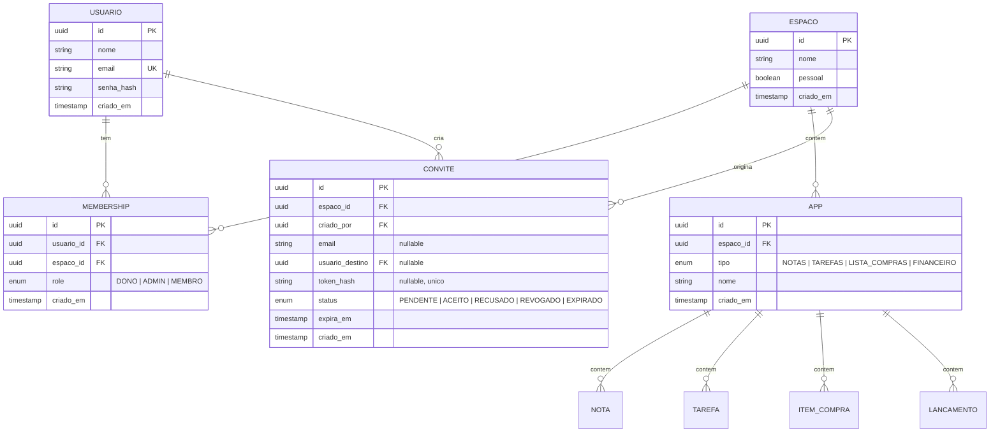

# Arquitetura

Modelo de dados, permissões, convites, e-mails e contratos de API. As decisões importantes estão registradas como ADRs no final, com o porquê de cada uma.

## Visão geral

```
[Web (React/Vite SPA)] ──HTTP/JSON──> [API (Spring Boot)] ──> [PostgreSQL]
                                            │
                                            └──> [EmailService] ──> Brevo/Resend
```

- API REST stateless servindo JSON. Clientes futuros (mobile, desktop) usam a mesma API — nada de lógica de negócio no frontend.
- Toda regra de autorização passa por **uma única função** (`can`, abaixo). Nenhum endpoint checa role diretamente.

## Modelo de dados



Restrições que valem código:
- `membership`: único por `(usuario_id, espaco_id)`.
- Todo Espaço tem exatamente **um** membership com role `DONO` (invariante de aplicação; um índice parcial único em Postgres também funciona).
- Espaço com `pessoal = true`: convites proibidos, exclusão proibida.
- Conteúdo dos Apps (`nota`, `tarefa`, `item_compra`, `lancamento`): cada tabela tem `app_id` FK e campos de auditoria `criado_por`, `criado_em`, `atualizado_em`. Os campos específicos de cada tipo estão descritos em [Visão e Domínio](01-visao-e-dominio.md#app).

## Autorização: a função `can`

**A regra mais importante da arquitetura.** Existe um único ponto de decisão de autorização:

```
can(usuario, acao, espaco) -> boolean
```

- Toda rota protegida pergunta ao `can` antes de agir. **Proibido** `if (role == ADMIN)` espalhado em service/controller.
- Hoje, `can` resolve a role do usuário no Espaço (via membership) e consulta um mapa fixo `role -> conjunto de ações` — a tabela de permissões de [Visão e Domínio](01-visao-e-dominio.md#roles-e-regras-de-permissão), em código.
- As **ações** são um enum: `CONTEUDO_GERENCIAR`, `APP_CRIAR`, `APP_GERENCIAR`, `MEMBRO_CONVIDAR`, `MEMBRO_REMOVER`, `MEMBRO_ALTERAR_ROLE`, `ESPACO_EDITAR`, `ESPACO_EXCLUIR`, `POSSE_TRANSFERIR`.
- Usuário sem membership no Espaço: `can` retorna falso para tudo — e a API responde **404** (não 403) para não vazar a existência do Espaço.

Por que assim: quando (se) migrarmos para permissões granulares, só a implementação interna do `can` muda — de mapa fixo para consulta a tabelas de permissão. Nenhum endpoint é tocado. Ver ADR-002.

## Autenticação

- Cadastro com nome, e-mail e senha. Senha com hash forte (BCrypt/Argon2 — nunca texto puro, nunca hash rápido tipo SHA).
- Login gera sessão. **Sessão via cookie httpOnly** é a recomendação para o web (mais simples e mais segura que JWT em localStorage); ver ADR-004.
- Recuperação de senha: token de uso único, com validade curta (ex.: 1h), enviado por e-mail. Guardar **hash** do token, nunca o token em si.
- Cadastro dispara e-mail de boas-vindas.

## Convites

Um único modelo (`convite`) cobre os três modos de entrega — a diferença é só quem carrega o token:

| Modo | `email` | `usuario_destino` | `token_hash` | Como chega |
|---|---|---|---|---|
| In-platform | — | ✅ | — | Aparece na lista de convites pendentes do usuário, que aceita/recusa no app |
| Por e-mail | ✅ | — | ✅ | E-mail com URL `https://app/convite/{token}` |
| Magic link | — | — | ✅ | Criador copia a URL e compartilha onde quiser |

Regras:
- Só quem tem a ação `MEMBRO_CONVIDAR` cria convites; convites em Espaço pessoal são rejeitados.
- Token: gerado com aleatoriedade criptográfica, **armazenado como hash** (vazamento do banco não vira acesso), com `expira_em` (sugestão: 7 dias).
- Aceitar: requer estar logado (ou cadastrar-se antes, mantendo o token no fluxo). Cria o membership com role `MEMBRO` e marca o convite como `ACEITO`. Convite expirado/revogado/já usado → erro claro.
- Se quem aceita já é membro, o convite é consumido sem duplicar membership.
- Admin/Dono podem **revogar** convites pendentes.
- Magic link é multiuso até expirar ou ser revogado? **Não** — no MVP, um convite = uma entrada (aceito uma vez, morre). Para convidar várias pessoas, cria-se vários convites. Simples e auditável. (Se doer na prática, evolui-se para convite multiuso com contador.)

## E-mails transacionais

Interface própria na aplicação:

```
EmailService.enviar(destinatario, template, dados)
```

Templates do MVP: `BOAS_VINDAS`, `RECUPERAR_SENHA`, `CONVITE`.

O provedor (Brevo, Resend, ou log no console em dev) é **detalhe de infraestrutura** atrás dessa interface. Trocar de provedor = escrever uma implementação nova, zero mudança no resto. Em desenvolvimento, a implementação "console" evita depender de conta externa.

## Contratos de API (Milestone 1–2)

Convenções: JSON, autenticação por sessão, erros com corpo `{ "erro": "codigo", "mensagem": "..." }`. Recurso inexistente **ou inacessível** → 404.

### Auth
```
POST   /auth/cadastro           { nome, email, senha }         -> 201 (cria espaço pessoal junto)
POST   /auth/login              { email, senha }               -> 200 + cookie de sessão
POST   /auth/logout                                            -> 204
POST   /auth/recuperar-senha    { email }                      -> 202 (sempre 202, sem vazar se o e-mail existe)
POST   /auth/redefinir-senha    { token, novaSenha }           -> 204
GET    /me                                                     -> 200 { id, nome, email }
```

### Espaços
```
GET    /espacos                                                -> 200 [ { id, nome, pessoal, minhaRole } ]
POST   /espacos                 { nome }                       -> 201
GET    /espacos/{id}                                           -> 200 { id, nome, pessoal, minhaRole, membros: [...] }
PATCH  /espacos/{id}            { nome }                       -> 200   (requer ESPACO_EDITAR)
DELETE /espacos/{id}                                           -> 204   (requer ESPACO_EXCLUIR; proibido se pessoal)
DELETE /espacos/{id}/membros/{usuarioId}                       -> 204   (requer MEMBRO_REMOVER; ou o próprio saindo)
```

### Apps e conteúdo (exemplo com Notas; demais tipos seguem o padrão)
```
GET    /espacos/{id}/apps                                      -> 200 [ { id, tipo, nome } ]
POST   /espacos/{id}/apps       { tipo, nome }                 -> 201   (requer APP_CRIAR)
PATCH  /apps/{id}               { nome }                       -> 200   (requer APP_GERENCIAR)
DELETE /apps/{id}                                              -> 204   (requer APP_GERENCIAR)

GET    /apps/{id}/notas                                        -> 200
POST   /apps/{id}/notas         { titulo, corpo }              -> 201
PATCH  /notas/{id}              { titulo?, corpo? }            -> 200
DELETE /notas/{id}                                             -> 204
```

### Convites
```
POST   /espacos/{id}/convites   { modo, email?, usuarioId? }   -> 201 { id, url? }  (requer MEMBRO_CONVIDAR)
GET    /espacos/{id}/convites                                  -> 200 (pendentes; requer MEMBRO_CONVIDAR)
DELETE /convites/{id}                                          -> 204 (revogar)
GET    /me/convites                                            -> 200 (convites in-platform pendentes para mim)
POST   /convites/{id}/aceitar                                  -> 204
POST   /convites/{id}/recusar                                  -> 204
POST   /convites/aceitar-token  { token }                      -> 204
```

## ADRs — decisões registradas

### ADR-001: Espaço pessoal é um Espaço comum com flag
Uma entidade só, `pessoal = true` bloqueando convites e exclusão. **Por quê:** dois conceitos dobrariam o código (queries, permissões, UI) para um comportamento 95% idêntico. A flag custa dois `if`s.

### ADR-002: Roles fixas agora, RBAC granular talvez depois
Três roles (`DONO`, `ADMIN`, `MEMBRO`) hardcoded, mas **toda** checagem passa pela função `can`. **Por quê:** RBAC granular é semanas de infraestrutura antes da primeira feature visível — veneno para um projeto que precisa de tração. A função `can` é a apólice de seguro: se o granular vier, só o interior dela muda. **Gatilho para revisitar:** usuários reais pedindo "quero que fulano só veja o app X".

### ADR-003: Convite é uma entidade única com três modos de entrega
In-platform, e-mail e magic link são o mesmo registro; muda apenas se o token é exposto e para quem. **Por quê:** três fluxos separados = três máquinas de estado para manter. Uma entidade = uma tabela, um ciclo de vida (`PENDENTE → ACEITO/RECUSADO/REVOGADO/EXPIRADO`), e cada modo pode ser implementado em milestone diferente sem migração.

### ADR-004: Sessão via cookie httpOnly no web (não JWT em localStorage)
**Por quê:** cookie httpOnly é imune a roubo por XSS, e sessão em servidor permite logout/revogação de verdade. JWT brilha em API pública ou microsserviços — não é o nosso caso. Quando o mobile chegar, a API pode passar a aceitar também um token opaco no header, sem quebrar o web. Requer proteção CSRF (o Spring Security já traz).

### ADR-005: Provedor de e-mail atrás de interface própria
`EmailService` da aplicação; Brevo/Resend/console são implementações. **Por quê:** e-mail transacional é commodity e free tiers mudam; ninguém deve reescrever fluxo de senha porque trocou de provedor. Bônus: em dev, roda sem conta externa.

### ADR-006: Redis fora do MVP
Sessões, tokens e cache vivem no Postgres por ora. **Por quê:** na escala do MVP, Postgres resolve tudo isso com uma dependência a menos para operar. **Gatilho para revisitar:** rate limiting sério, cache com TTL agressivo, ou filas.

## Deixado em aberto de propósito

Decisões de quem implementa (e onde mais se aprende):
- Estrutura de pastas e camadas internas do backend (controller/service/repository? hexagonal? decida e seja consistente).
- Bibliotecas do frontend (roteamento, fetch/cache, componentes, formulários).
- Estratégia de migração de banco (Flyway e Liquibase são os candidatos óbvios no ecossistema Spring).
- Estratégia de testes — mas PRs de feature devem vir com algum teste da regra de negócio central (o `can` é o candidato número 1).
